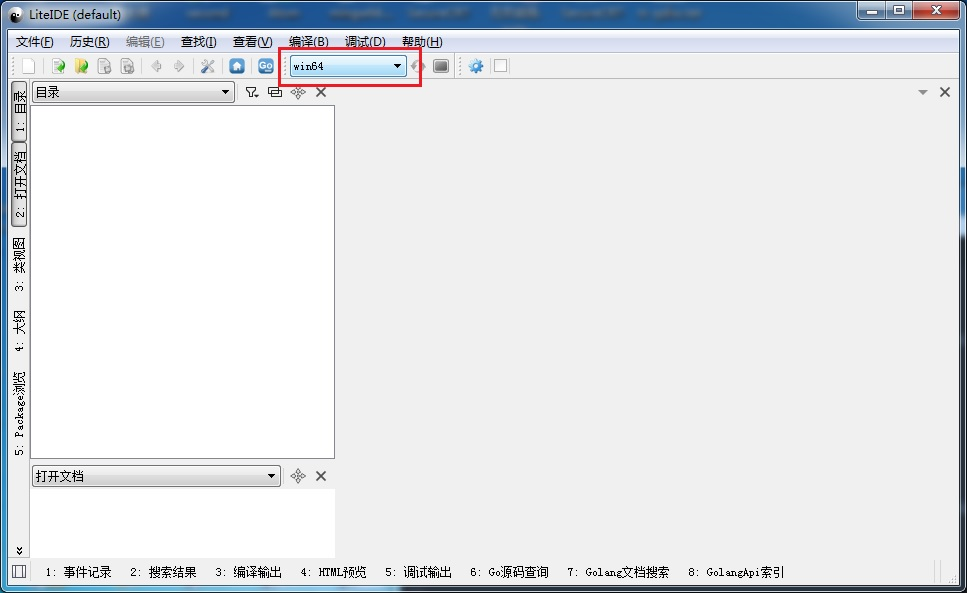
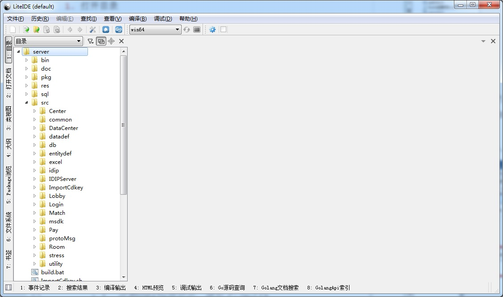
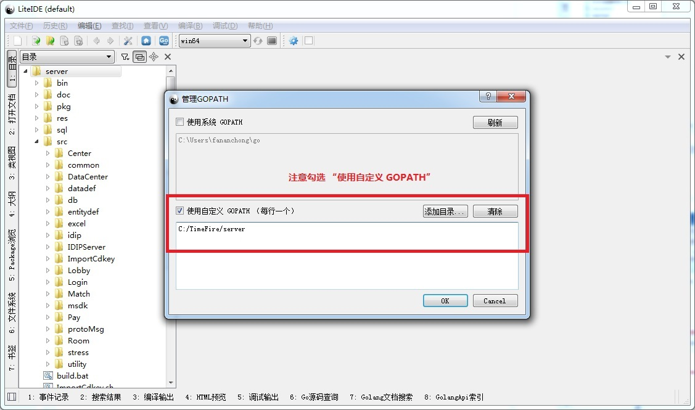
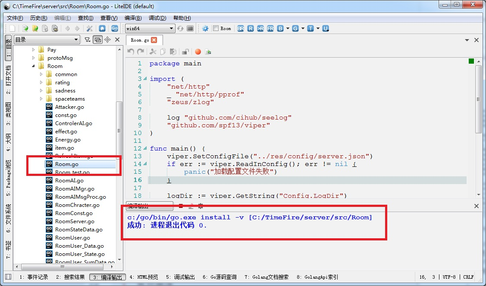

## Go语言安装

  1. 从官网下载安装包：go1.9.2.windows-amd64.msi
  1. 也可以直接使用已经下载好的安装包：assets/go1.9.2.windows-amd64.msi
  1. 双击安装包，一路next，直至安装完毕
  1. 打开控制台，键入go version回车。正确显示版本，则安装成功


## LiteIDE安装

  1. 从官网下载安装包：liteidex33.windows-qt5.zip
  1. 也可以直接使用已经下载好的安装包：assets/liteidex33.windows-qt5.zip
  1. 解压到c盘，创建liteide.exe的桌面快捷方式
  1. 双击liteide.exe，正常打开程序，则表示安装成功


## win gcc 64bit安装

  1. 从sourceforge下载安装包：https://sourceforge.net/projects/mingw-w64/files/Toolchains%20targetting%20Win64/Personal%20Builds/mingw-builds/4.8.2/threads-posix/seh/x86_64-4.8.2-release-posix-seh-rt_v3-rev2.7z/download
  1. 也可以直接使用已经下载好的安装包：assets/x86_64-4.8.2-release-posix-seh-rt_v3-rev2.7z
  1. 解压到c盘
  1. 添加环境变量：c:\\x86_64-4.8.2-release-posix-seh-rt_v3-rev2\\mingw64\\bin (**注意路径与实际解压后一致**)


## 下载TimeFire代码

  1. 在C盘根目录下，执行git clone
  
  ```dos
  git clone http://192.168.39.64/tech/Server/TimeFire
  ```


## 配置LiteIDE

1. 切换当前环境

    

1. 打开目录

    点击菜单栏：文件 - 打开目录，选择C:\\TimeFire\\server后，结果如下：

    

    同样操作，可以添加其他目录。

1. 配置GOPATH路径

    点击菜单栏：查看 - 管理GOPATH，结果配置成如下：

    

    关于GOPATH的说明：
    - GOPATH路径类似C++的Include目录路径。所有依赖库需要让Go编译器知道，那么可以在GOPATH中配置。
    - GOPATH路径有个特点，Go编译器通过GOPATH，真正搜索的路径为 mypath/`src`。如我想把我的依赖库都放到C:/mylib下，并希望Go编译器能正确找到编译。那么你需要做2件事:
    
       > 1. 设置GOPATH路径中，增加 C:/mylib
       > 2. 把你的依赖库，拷贝进C:/mylib/src目录下

1. 执行编译

    **双击 server/src/Room/Room.go**；然后按Ctrl+F8；

    

    同样类似操作，可以编译Login、Match等等。
