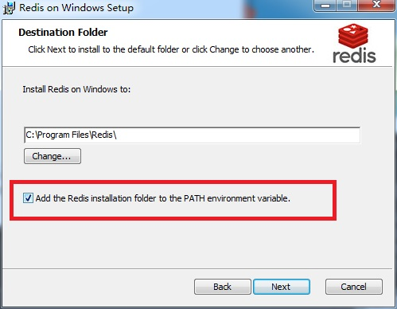

本文介绍的是 window 单机服务器部署

## 安装Redis

  1. 从官网下载安装包：Redis-x64-3.2.100.msi
  1. 也可以直接使用已经下载好的安装包：assets/Redis-x64-3.2.100.msi
  1. 一路next，期间勾选一处勾选如下图，直至install

  

  1. 在CMD控制台执行redis-cli --version，正常显示版本号，则安装成功


## 配置文件

复制并重命名 TimeFire/server/res/config/server.json.example 为 TimeFire/server/res/config/server.json

注意：默认服务器组只监听本机。若要其他机器客户端能连接本机，请替换 TimeFire/server/res/config/server.json 文件中 `localhost` 字符串替换为 `你的机器IP`。


## 确保所有服务器执行文件已编译

  - 在IDE中依次编译

  - 或者 运行TimeFire/server/build.bat 批处理编译


## 执行 TimeFire/server/start.bat

正常启动，最终有5个服务进程。如果启动失败，可以查看 TimeFire/server/log 目录中对应的日志定位错误


## 可能的启动失败

**端口冲突**

如登录服务的监听端口是8080，可能有程序会占用8080端口，可以关闭占用程序，或换个端口。

例如修改如下：

1. 更改 TimeFire/server/res/config/server.json

    Login - Port 字段值 改为：`8081`

1. 重启服务器组

1. 客户端同样修改登录端口，即可登录游戏


**Server ID is duplicate**

显示如下文字

```dos
[ERR] [serverMgr.go:75] Server ID is duplicate!!!!!
```

window下非正常关闭，部分关闭逻辑没有执行，导致 redis数据没有被清除导致。

通过 `ctrl + c` 方式关闭服务进程窗口，可以正常同步服务进程。

*该BUG待修复，修复后，这里说明要删除。*

==现已经不影响启动，不再扔异常，但是仍会报这个错误==


## U3d客户端连接

待填写
