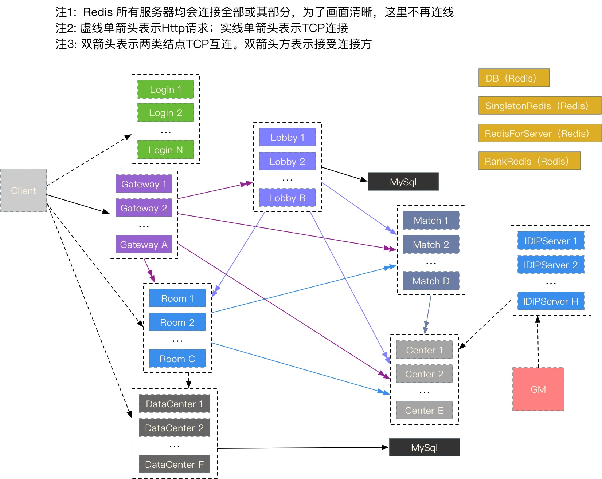

## 架构图

服务器有以下几个进程：

名称       | 说明
-----------|----------
Login      | 登录服务
Gateway    | 网关服务
Lobby      | 大厅服务
Room       | 房间服务
Match      | 匹配服务
Center     | 中心服务
DataCenter | 数据中心代理
IDIPServer | IDIP服务

  - 客户端先短连 Login，获取 Gateway 地址
  - 然后客户端长连 Gateway，如匹配进入战斗则再连 Room
  - 玩家统计数据、日志型数据 通过 DataCenter 获取

## 各服务器功能

#### Login

  - 验证账号
  - 返回Gateway地址

## Gateway

  - 保持客户端长连接
  - 转发消息

## Lobby

  - 主要处理个人业务逻辑
  - 部分跨服务器逻辑的入口点。（如匹配）
  - 统计各渠道平台在线人数

## Room

  - 具体核心玩法

## Match

  - 主要的匹配逻辑。单人、双人匹配、四人匹配

## Center

  - 外接 IDIP，处理GM逻辑
  - 公告管理
  - 邮件相关

## DataCenter

  - 接收 Room Post过来的个人每局统计数据、其他一些统计数据等
  - 提供客户端查询个人统计数据、每局数据等等

## IDIP

  - 转发 GM消息 给 Center
