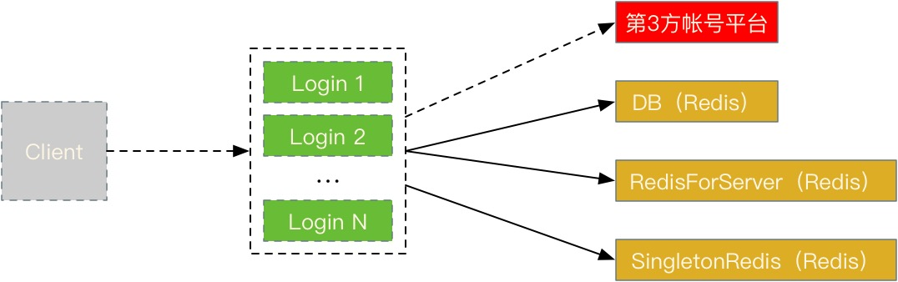
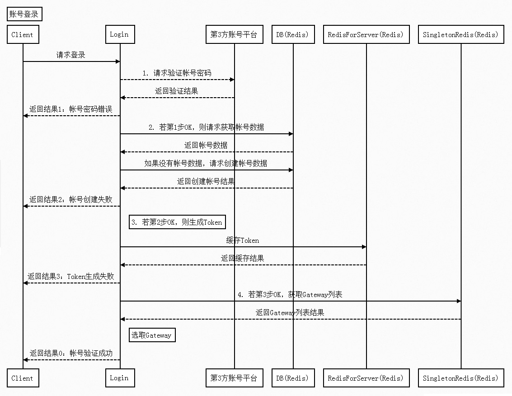

## 网络交互对象

  - Client
  - DB (Redis)
  - RedisForServer (Redis)
  - SingletonRedis (Redis)
  - 第3方账号平台

## 交互流程 - 账号登录

本时序图说明：

  - 略去了一些无关紧要的步骤，包括验证白名单、保存渠道信息等。
  - 第2步代码上有缺陷，严谨的做法应该是原子操作：**当且仅当没有账号数据，创建之**

## 其他说明

Login服务内容非常少，仅有以下：

  - 账号登录
  - 激活验证码（包含了手机绑定功能）

**激活验证码，甚至可以从登录服务中移除。**

