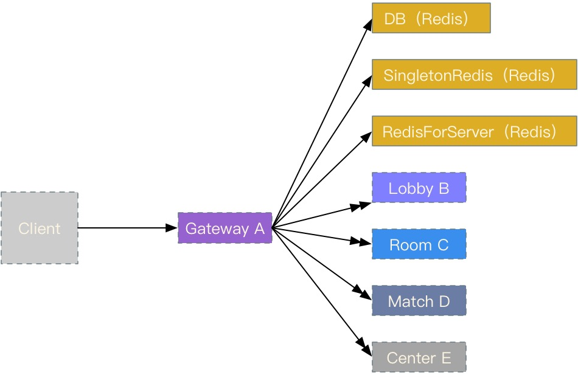
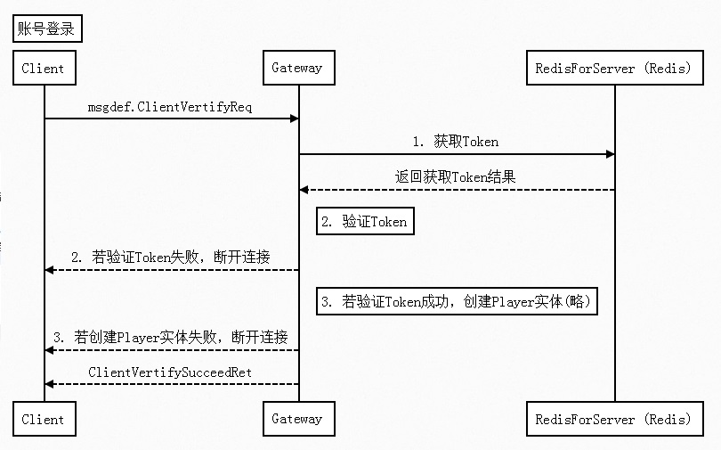

## 网络交互对象

  - Client
  - DB (Redis)
  - SingletonRedis (Redis)
  - RedisForServer (Redis)
  - Lobby
  - Room
  - Match
  - Center

## 交互流程 - 账号登录

## 交互流程 - 信息转发

转发功能主要已经被网络层封装。这里略。详细内容见下一章。

时序图略

## TimeFire/server/src/Gateway

Gateway的功能只有以下几个：

  - 验证登录Gateway，维护客户端网络会话
  - 触发创建Player实体，发送`主角自己关注的属性`
  - 发送proto.json，给客户端
  - 客户端消息转发至某服务（包括实体消息）

## 代码阅读

Gateway代码是使用Zeus网络层的最小代码示例。

同时也是如何使用Entity的最小代码实例。

可以通过Gateway代码，来了解如何使用Zeus网络层创建服务。

同时也可以通过Gateway代码，来了解如何使用Entity对象。

## 源代码分析

阅读Gateway代码的主要难度在于看懂Zeus网络层代码。

理解 Zeus网络层代码，自然能轻松理解Gateway代码。

下一章将重点介绍Zeus网络层相关内容，然后再介绍下Gateway代码相关内容。
