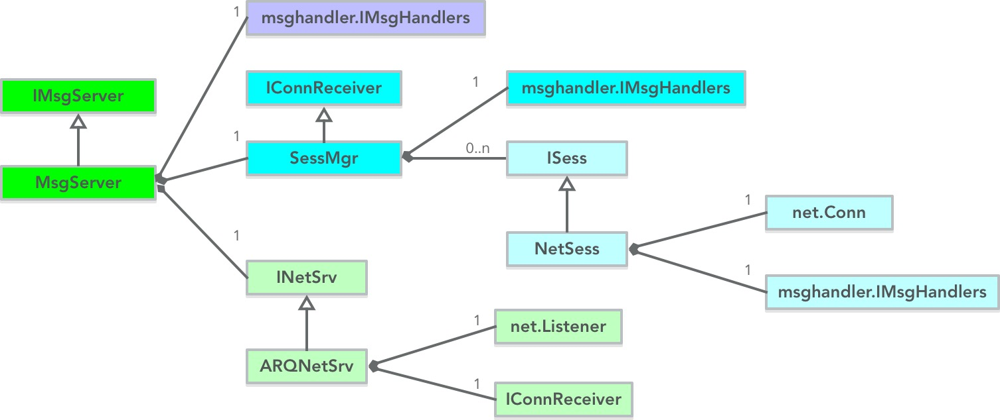

## 主要功能

  - 提供TCP服务功能
  - 管理TCP网络会话
  - 提供消息加解密功能、心跳检查等常见网络安全措施
  - 提供消息转发机制
  - 提供统一的Token身份验证、登录服务器机制

## 各文件介绍

```tree
├─sess
│      Const.go
│      MsgEncode.go
│      MsgReader.go
│      MsgServer.go
│      NetClient.go
│      NetSrv.go
│      Sess.go
│      SessMgr.go
```

文件名 | 说明
-------|-----------------------------
Const.go | 一些常量定义
MsgEncode.go | 消息加密、解密接口
MsgReader.go | 从net.Conn对象中，接收一个消息
MsgServer.go | 一个完备的TCP服务器
NetClient.go | 创建一个网络会话（用于服务器组内互连用）
NetSrv.go    | 封装使用net.Listener的网络服务类
Sess.go      | 一个网络会话类
SessMgr.go   | 网络会话管理类


## 类关系图



有几点需要说明下：

#### IConnReceiver

ARQNetSrv通过IConnReceiver接口，可以制定化如何处理到来的网络连接。

具体实现在 SessMgr 类中实现

```go
func (mgr *SessMgr) acceptConn(conn net.Conn) {

	// ...(略)...
}
```

#### msghandler.IMsgHandlers

MsgServer、SessMgr、NetSess类均 `组合嵌入` 了msghandler.IMsgHandlers。

默认的，在实例化MsgServer时，同时实例化了msghandler.IMsgHandlers。并赋值给SessMgr

```go
func NewMsgServer(protocal string, addr string, maxConns int) IMsgServer {
	srv := new(MsgServer)

	mh := msghandler.NewMsgHandlers()

	srv.IMsgHandlers = mh
	srv.SessMgr = newSessMgr(mh)

	// ...(略)...

	return srv
}
```

SessMgr接收到新连接时，把 msghandler.IMsgHandlers 实例赋值给NetSess对象

```go
func (mgr *SessMgr) putSess(sess iserver.ISess) {

	// ...(略)...

	sess.SetMsgHandler(mgr.msgHandlers)

	// ...(略)...
}
```

因此，**默认情况下，MsgServer、SessMgr、NetSess类实例的消息处理器都是指向同一个消息处理器的**。


## 登录验证

登录验证过程：

```go
func (mgr *SessMgr) acceptConn(conn net.Conn) {

	msg, _, _, err := readARQMsgForward(conn)

	//如果是连接扫描就强制关掉
	if err != nil || msg == nil {
		//log.Error("accept conn and  read first message error ", err, conn.RemoteAddr())
		conn.Close()
		return
	}

	if msg.Name() != "ClientVertifyReq" {
		log.Error("read first message , but message is not client vertify req ", conn.RemoteAddr())
		conn.Close()
		return
	}

	m := msg.(*msgdef.ClientVertifyReq)

	sess := mgr.newSess(conn)
	if err := mgr.vertifySess(m, sess); err != nil {
		sess.Close()
		log.Info("client vertify failed", conn.RemoteAddr(), err)
		return
	}

	mgr.putSess(sess)

	sess.DoNormalMsg("SessVertified", msg.(*msgdef.ClientVertifyReq).UID)
	sess.Touch()
	sess.Start()
}
```

代码说明：

  - ClientVertifyReq 必须是客户端连接成功后的第一个消息
  - mgr.vertifySess 进行 Token 验证
  - 成功后，主动触发 SessVertified 消息


## 消息转发

```go
func (sess *NetSess) recvLoop() {

	for {

		select {
		case <-sess.ctx.Done():
			return
		default:
			msg, msgID, rawMsg, err := readARQMsgForward(sess.conn)
			if err != nil {
				log.Error("tcp read message error ", err, sess.conn.RemoteAddr())
				if sess.IsClosed() {
					return
				}

				sess._isError = true
				if sess.connNotifier != nil {
					sess.connNotifier.connErr(sess.GetID())
				} else {
					sess.Close()
				}
				return
			}

			if msg != nil && msg.Name() != "HeartBeat" {
				sess.FireMsg(msg.Name(), msg)
			}

			if rawMsg != nil {
				sess.FireMsg("MsgForward", &RawMsg{msgID, rawMsg})
			}

			sess.Touch()
		}
	}
}
```

代码说明：

  - readARQMsgForward 函数，返回msg 或者 rawMsg。分别代表本地消息、转发消息
  - 若是转发消息，则主动触发 MsgForward 消息。主要给Gateway把客户端消息投递到服务器组内某服务器上。
