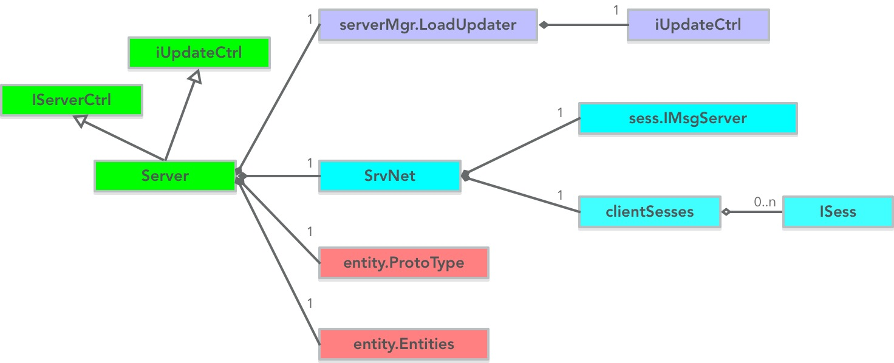

## 主要功能

  - 提供一个完整的服务器组内服务
  - 提供服务器组内互连机制
  - 提供实体系统的网络通信机制


## 各文件介绍

```tree
├─server
│      Helper.go
│      IDFetcher.go
│      server.go
│      ServerMsgProc.go
│      SrvNet.go
```

文件名 | 说明
-----------------|-----------------------------
Helper.go        | 工具类：获取可用TCP端口；获取服务器组内永久唯一ID
IDFetcher.go     | 工具类：获取服务器组内临时唯一ID
server.go        | 提供一个完整的服务器组内服务（组内服务互连、实体通信基础）
ServerMsgProc.go | 实体系统基础通信协议处理逻辑（将消息投递给实体，并让实体触发动作）
SrvNet.go        | 一个能服务器组内互连的服务器


## 类关系图



有几点需要说明下：

#### iUpdateCtrl

serverMgr.LoadUpdater 负载上报器，可制定化 获取负载值逻辑。

在 Server类中 被实现：

```go
func (srv *Server) GetLoad() int {
	// ...(略)...
}
```
实现逻辑为取 max(CPU使用率, 内存使用率)，代码略，不再粘贴。


#### IServerCtrl

```go
type IServerCtrl interface {
	Init() error
	MainLoop()
	Destroy()

	GetLoad() int
}
```
通过 IServerCtrl 接口，可以制定化 上述函数内容


#### sess.IMsgServer

相关内容请参见：[zeus/sess](4-3.Zeus网络封装层介绍之sess包.md)

#### clientSesses

一个*sync.Map类型容器，保存服务器组内其他服务器的网络会话对象


#### 实体相关

本章将不介绍实体相关内容，在《5.Entity系统》章节中，详细展开。


## 主循环与每帧处理消息

```go
// Run 逻辑入口
func (srv *Server) Run() {
	// ...(略)...

	go srv.doLoop()

	// ...(略)...
}

func (srv *Server) doLoop() {
	for {
		select {
		// ...(略)...
		case <-srv.ticker.C:
			srv.MainLoop()
		}
	}
}

// MainLoop 主循环
func (srv *Server) MainLoop() {
	srv.SrvNet.MainLoop()
	srv.srvCtrl.MainLoop()
	// ...(略)...
}
```

代码说明：

  - 所有网络消息收到后，会进入消息缓存队列，并在下一帧处理
  - srv.SrvNet.MainLoop() 内部实现即为从消息缓存队列中获取消息并执行
  - 帧率在配置中定义。TimeFire/server/res/config/server.json中的各各FPS字段


## 消息服务器组内投递

```go
// PostMsgToSrv 根据srvID号把消息投递到相应的服务器上
func (srv *SrvNet) PostMsgToSrv(srvID uint64, msg msgdef.IMsg) error {
	if srvID == iserver.GetSrvInst().GetSrvID() {
		srv.msgSrv.FireMsg(reflect.TypeOf(msg).Elem().Name(), msg)
		return nil
	}

	if srv.srvID < srvID {
		isess, ok := srv.clientSesses.Load(srvID)
		if ok {
			isess.(iserver.ISess).Send(msg)
			return nil
		}
	} else {
		isess := srv.msgSrv.GetSession(srvID)
		if isess != nil {
			isess.Send(msg)
			return nil
		}
	}

	return fmt.Errorf("SrvNet server %d  Server not existed, id:%d", srv.srvID, srvID)
}

// PostMsgToCell 将消息投递给某个Space
func (srv *SrvNet) PostMsgToCell(srvID uint64, celliD uint64, msg msgdef.IMsg) error {
	srvMsg, err := srv.packSrvMsg(cellID, msg)
	if err != nil {
		return err
	}

	return srv.PostMsgToSrv(srvID, srvMsg)
}
```

## 服务器组内互连

```go
// 10秒一次刷新过期时间, 25~35秒一次刷新一次服务器列表
func (srv *SrvNet) refresh() {
	srv.RefreshSrvInfo()

	ticker := time.NewTicker(10 * time.Second)
	defer ticker.Stop()

	srvNetTicker := time.NewTicker(time.Duration(rand.Intn(10)+25) * time.Second)
	defer srvNetTicker.Stop()

	for {
		select {
		case <-ticker.C:
			if err := serverMgr.GetServerMgr().Update(srv.srvInfo); err != nil {
				log.Error(err)
			}
		case <-srvNetTicker.C:
			srv.RefreshSrvInfo()
		}
	}
}

func (srv *SrvNet) RefreshSrvInfo() {

	remoteSrvList, err := serverMgr.GetServerMgr().GetServerList()
	if err != nil {
		log.Error("fetch server info failed", err)
		return
	}
	for _, srvInfo := range remoteSrvList {
		srv.tryConnectToSrv(srvInfo)
	}
}

func (srv *SrvNet) tryConnectToSrv(info *iserver.ServerInfo) {

	if !srv.isNeedConnectedToSrv(info) {
		return
	}

	srv.pendingSesses.Store(info.ServerID, nil)
	go func() {

		s, err := sess.Dial("tcp", info.InnerAddress)
		if err != nil {
			srv.pendingSesses.Delete(info.ServerID)

			log.Errorf("Connect failed. %d to %d Addr %s, error:%v", srv.srvID, info.ServerID, info.InnerAddress, err)
			return
		}

		srv.pendingSesses.Store(info.ServerID, s)

		s.SetID(info.ServerID)
		s.SetMsgHandler(srv.msgSrv)

		s.Send(&msgdef.ClientVertifyReq{
			Source: srv.srvType,
			UID:    srv.srvID,
			Token:  srv.token,
		})
		s.Start()

		log.Info("SrvNet try connect to ", info.ServerID)

	}()
}
```
