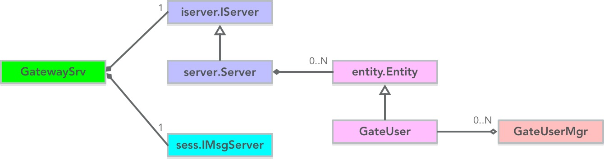

## 主要功能

参见 [Gateway的网络交互](3.Gateway的网络交互.md)

总结下，以下功能：

  - 验证登录Gateway，维护客户端网络会话
  - 触发创建Player实体，发送`主角自己关注的属性`
  - 客户端消息转发至某服务（包括实体消息）


## 各文件介绍

```tree
├─Gateway
│      GateUser.go
│      GateUserMgr.go
│      GateUserMgr_login.go
│      GateUserMsgProc.go
│      Gateway.go
│      GatewayServer.go
│      GatewaySrvMsgProc.go
```

文件名                | 说明
---------------------|-----------------------------
GateUser.go          | Player实体在 Gateway 上的entity定义
GateUserMgr.go       | GateUser类对象管理类
GateUserMgr_login.go | 登录登出逻辑入口
GateUserMsgProc.go   | 转发消息、转发实体消息过程实现
Gateway.go           | 程序入口函数
GatewayServer.go     | 一个Gateway服务器
GatewaySrvMsgProc.go | 登录Gateway成功后触发SessVertified消息的实现


## 类关系图



有几点需要说明下：

#### GatewaySrv

GatewaySrv 结构很清晰，包含一个 服务器组内服务、 一个面向客户端的TCP服务。

#### server.Server

前面讲过，详细参见：[zeus/server](4-4.Zeus网络封装层介绍之server包.md)

#### sess.IMsgServer

前面讲过，详细参见：[zeus/sess](4-3.Zeus网络封装层介绍之sess包.md)

#### entity.Entity

这里暂时跳过，在《5.Entity系统》中详细介绍

#### GateUser与GateUserMgr

用户类与用户管理类


## 一些被触发的入口函数

#### main

```go
func main() {
	// ...(略)...
	GetSrvInst().Run()
}
```

实例化 GatewaySrv 并 run()

GetSrvInst().Run() 语句执行，会实例化 server.Server、sess.IMsgServer。

即对客户端、服务器组内 开启服务。


#### MsgProc_SessVertified

```go
func (p *GatewaySrvMsgProc) MsgProc_SessVertified(content interface{}) {

	uid := content.(uint64)
	GetUserMgr().login(uid)
}
```

客户端连接Gateway后，会发送 msgdef.ClientVertifyReq。
server.Server内部做Token验证等，通过后，会触发MsgProc_SessVertified回调函数

GetSrvInst().Run() 中会调用下述函数，确保MsgProc_SessVertified回调函数被注册：
```go
func (srv *GatewaySrv) Init() error {
	// ...(略)...
	srv.clientSrv.RegMsgProc(&GatewaySrvMsgProc{})
	// ...(略)...
}
```

#### GateUser相关的一些入口函数

这里暂时跳过，在《5.Entity系统》中详细介绍
