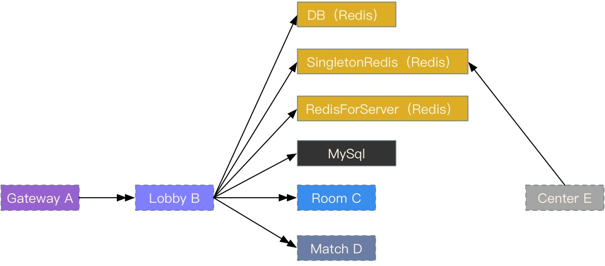

## 网络交互对象

  - DB (Redis)
  - SingletonRedis (Redis)
  - RedisForServer (Redis)
  - MySql
  - Gateway
  - Room
  - Match

几点说明：

  - Lobby与Center没有直接的消息交互代码。

    相关的功能，如mail系统，通过SingletonRedis (Redis) 和 DB (Redis)，协作完成。

## 主要功能

  - 各渠道在线人数统计
  - 好友系统
  - Lobby服务GM命令
  - 商品系统
  - 登录奖励系统
  - 邮件系统
  - 单人匹配、组队匹配

## 各功能介绍

暂略
