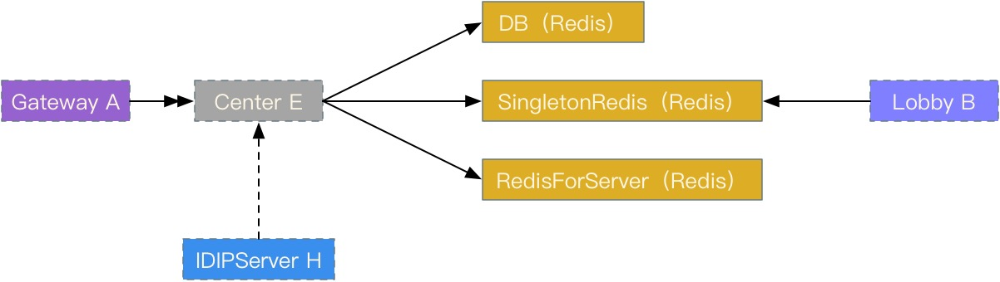

## 网络交互对象

  - DB (Redis)
  - SingletonRedis (Redis)
  - RedisForServer (Redis)
  - Gateway
  - IDIPServer

几点说明：

  - Room与Center目前没有交互
  - Match与Center目前没有交互
  - Lobby与Center没有直接的消息交互代码

## 主要功能

  - 游戏公告
  - 邮件功能

## 各功能介绍

暂略
