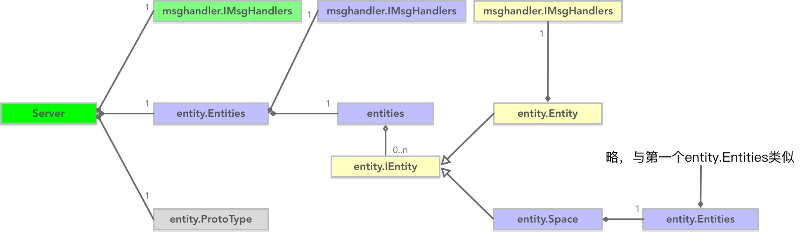
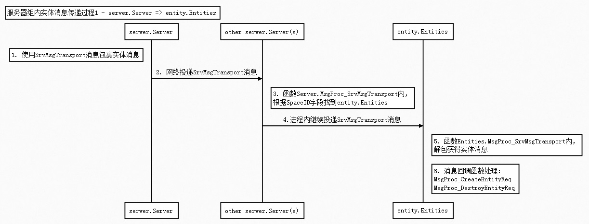
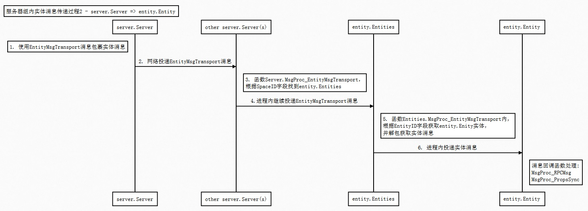
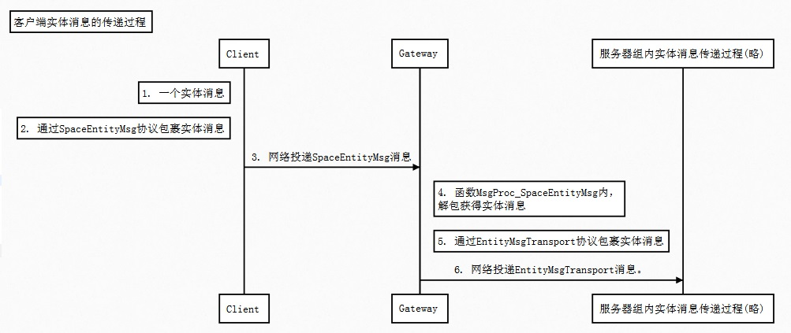
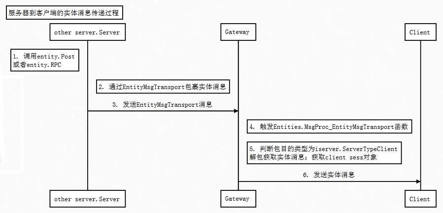

## 网络层与实体的类关系图



要点说明：

  - `server.Server`是一个`实体管理器(entity.Entities)`
  - 实体管理器(entity.Entities)有字段entities是一个*sync.Map，管理维护`实体(entity.IEntity)`
  - 实体(entity.IEntity)有2类：
    - 简单实体，即entity.Entity
    - 也可以是带实体管理器的实体`entity.Space`
  - 可以看出，目前TimeFire中，实体层次是3层:
    - server.Server管理维护entity.Entity与entity.Space
    - entity.Space管理维护entity.Entity


## 3个msghandler.IMsgHandlers

server.Server、entity.Space(entity.Entities)、entity.Entity的msghandler.IMsgHandlers在Zeus层，已经注册了各自的消息处理函数。

能使网络层的实体相关消息正确的投递到entity.Entity上。

  - server.Server 实体相关的网络消息处理，代码位于：zeus/server/ServerMsgProc.go

  - entity.Space(entity.Entities)实体相关的网络消息处理，代码位于：zeus/entity/Entities_MsgProc.go

  - entity.Entity实体相关的网络消息处理，代码位于：zeus/entity/Entity_Msg.go


接下来介绍下实体消息是如何按下面的方式正确到达entity.Entity的：
  - entity message => server.Server => ... => server.Server => entity.Entity
  - entity message => server.Server => ... => server.Server => entity.Space(entity.Entities) => entity.Entity

## 实体消息如何正确到达实体

分3种情况：

  - 服务器组内实体消息传递过程

    server entitiy msg => ... => entity.Entity

  - 客户端实体消息传递过程

    client entitiy msg => ... => entity.Entity
    
  - 服务器到客户端的实体消息传递过程
  
    server entity msg => ... => client entity.Entity
    

##### 一、服务器组内实体消息传递过程

服务器组内消息传递也有几种，下面依次分析：

1. server.Server => entity.Entities

    

    需要注意的是SrvMsgTransport协议的SpaceID字段。

    目前有2个entity.Entities。

        - SpaceID为0，找到的本server.Server
        - SpaceID非0，找到的是对应的entity.Space

1. server.Server => entity.Entity

    

    需要注意的是EntityMsgTransport协议的SpaceID字段、EntityID字段。

*友情提示：上面2副图中的`第2步网络投递other server.Server(s)`，实际上关于如何投递，是实体系统根据自身逻辑控制的，如可以进程内投递给server.Server自己；或者只投递给某个other server.Server等等。*


##### 二、客户端实体消息的传递过程

客户端实体消息的传递也有几种，下面依次分析

1. Client->Gateway->服务器组内传递过程

    

    可以看出，客户端实体消息都是最开始走Gateway的。然后服务器组内传递过程


1. Client->Room

    首先需要知道，客户端只能给entity.Entity传递消息。

    即，**客户端无法给entity.Entities传递消息**。原因很简单，权限问题。

    因此客户端实体消息的传递过程的完整过程为：

    client entity msg => server.Server => ... => entity.Entity

    那么，如果Entity上的所有消息处理函数都注册到了 Room的client sess上，那么就可以直接：

    client entity msg => Room => entity.Entity.MsgProc_XXX / entity.Entity.RPC_XXX

    TimeFire也是这样干的：

    ```go
    func (proc *SpaceSessesMsgProc) MsgProc_SpaceUserConnect(content interface{}) {
    	// ...(略)...
    	imh, ok := space.(msghandler.IMsgHandlers)
    	if !ok {
    		seelog.Error("this not go happen")
    		return
    	}

    	imh.FireMsg("SpaceUserSess", sess)
    }
    func (proc *SpaceMsgProc) MsgProc_SpaceUserSess(sess iserver.ISess) {
	     // ...(略)...
	     ise, ok := ie.(iserver.ISpaceEntity)
	     if !ok {
		       proc.space.Error("conert to ispaceentity error , strange!! ")
		       return
	     }
	     ise.SetClient(sess)
	     // ...(略)...
    }
    ```

    Client连接Room成功后，会走Client->Room发送SpaceUserConnect struct消息。

    然后，MsgProc_SpaceUserSess会被执行，调用 ise.SetClient(sess)，entity.Entity上的消息处理注册到Room的client sess。

    至此，Client->Room 实体消息路子打通。


##### 三、服务器到客户端的实体消息传递过程

Zeus已经封装好了2个方法：

函数        | 说明
------------|------------------------------
Entity.Post | 第一个参数为 iserver.ServerTypeClient时，就是往客户端投递
Entity.RPC  | 投递RPC消息，也是调用Entity.Post来投递

实体消息传递过程，主要涉及函数
  - Entity.Post
  - Entities.MsgProc_EntityMsgTransport

关键在于理解上面2个函数内 iserver.ServerTypeClient 相关的if分支内容。

下面介绍下详细投递过程，也是2种情况：

1. other server -> Gateway -> Client

    

    这里可能的疑问是，Post投递的目标明明是iserver.ServerTypeClient，为什么会往Gateway发送？

    看下列代码：

    ```go
    func (e *Entity) regSrvID() {
    	// ...(略)...
    	if iserver.GetSrvInst().GetSrvType() == iserver.ServerTypeGateway {
    		if err := dbservice.EntitySrvUtil(e.entityID).RegSrvID(
    			iserver.ServerTypeClient,
    			iserver.GetSrvInst().GetSrvID(),
    			e.GetSpaceID(),
    			e.entityType,
    			e.dbid); err != nil {
    			e.Error("Reg SrvID failed ", err)
    			return
    		}
    	}
      // ...(略)...
    }
    ```

    Gateway上的实体创建成功后，会向中心(redis)上注册自己实体的信息。它把自己的服务类型注册成了iserver.ServerTypeClient。因此，实体通过iserver.ServerTypeClient查询到的服务器ID，都是Gateway的服务器ID。

    所以iserver.ServerTypeClient类型的消息，都会发往Gateway。


1. Room -> Client

    ```go
    func (e *Entity) Post(srvType uint8, msg msgdef.IMsg) error {
    	// ...(略)...

    	//如果投递给客户端且本地就有客户端连接话，直接投递
    	if srvType == iserver.ServerTypeClient && e.GetClientSess() != nil {
    		e.GetClientSess().Send(msg)
    		return nil
    	}

    	// ...(略)...
    }
    ```
    可以看到 Room 上发起的Post消息投递给客户端的，都会直接进入 上图代码分支。

    即直接 Room -> Client
