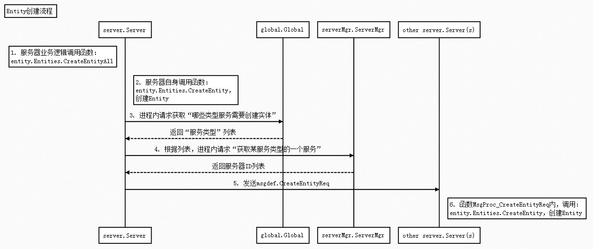

## 时序图



## 涉及主要函数

函数                      | 说明
--------------------------|-----------------------------
CreateEntityAll          | 服务器端，发起创建实体操作
CreateEntity             | 创建一个实体
MsgProc_CreateEntityReq  | 消息回调函数，触发创建一个实体

CreateEntityAll、MsgProc_CreateEntityReq 函数过程都非常清晰，略

CreateEntity，实体类 实例化过程有点复杂，本文最后介绍之。


## 实体创建规则

实体创建规则，即实体会在哪些服务器上创建

在服务开始时，通过IEntityProto.RegProtoType接口，注册实体会在该类型服务上创建。

例如：

```go
func (srv *LobbySrv) Init() error {
	srv.RegProtoType("Player", &LobbyUser{})
	// ...(略)...
}
func (srv *RoomSrv) Init() error {
	srv.RegProtoType("Player", &RoomUser{})
	// ...(略)...
}
func (srv *GatewaySrv) Init() error {
	srv.RegProtoType("Player", &GateUser{})
	// ...(略)...
}
```

Lobby、Gateway、Room在服务启动时，都注册了Player实体。且Player实体在每种类型服务上的具体实例化类。

即创建Player实体时：
  - 在Lobby上创建了LobbyUser实例
  - 在Room上创建了RoomUser实例
  - 在Gateway上创建了GateUser实例

Player实体在它实体类 实例化后，需要保存 实体名 - 实体ID - （服务类型，所在服务ID）列表等（还有其他数据）。

这些在函数CreateEntity内实现，本文最后介绍之。

## global.Global

IEntityProto.RegProtoType接口，内部实现，就是把信息保存到 global.Global 这个`分布式全局对象`内

关于global.Global是如何实现的，请自行阅读zeus/global包代码。


## serverMgr.ServerMgr

用于`服务发现`，前面章节介绍过，可以获取某服务类型一个服务，获取方式为轮询获取。


## CreateEntity函数内部实现过程

##### 1. Entities.CreateEntity
```go
func (es *Entities) CreateEntity(entityType string, entityID uint64, dbid uint64, spaceID uint64, initParam interface{}, syncInit bool, isGhost bool) (iserver.IEntity, error) {
	// ...(略)...
	ie := iserver.GetSrvInst().NewEntityByProtoType(entityType).(iEntityCtrl)
	// ...(略)...
	ie.OnEntityCreated(entityID, entityType, dbid, spaceID, ie, es, initParam, syncInit, isGhost)
	// ...(略)...
}
```
代码分析:
  - NewEntityByProtoType，根据 实体名，创建实体实例
  - ie.OnEntityCreated，触发Entity.OnEntityCreated

##### 2. Entity.OnEntityCreated
```go
func (e *Entity) OnEntityCreated(entityID uint64, entityType string, dbid uint64, spaceID uint64, protoType interface{}, entities iserver.IEntities, initParam interface{}, syncInit bool, isGhost bool) {
	// ...(略)...
	e.state = iserver.Entity_State_Init
	// ...(略)...
	if syncInit {
		ies := e.ieState
		ies.OnInit()
		ies.OnAfterInit()
	}
}
func (e *Entity) MainLoop() {
	// ...(略)...
	ies := e.ieState
	switch e.state {
	case iserver.Entity_State_Init:
		{
			ies.OnInit()
			ies.OnAfterInit()
		}
	// ...(略)...
	}
}
```
代码分析：
  - syncInit参数确定是否延迟初始化
  - 最终都会调到Entity.OnInit和Entity.OnAfterInit
  - Entity.OnInit和Entity.OnAfterInit需要重点关注

##### 3. Entity.OnInit

```go
func (e *Entity) OnInit() {
	e.state = iserver.Entity_State_Loop
	e.InitProp(GetDefs().GetDef(e.entityType))
	e.RegMsgProc(e.GetRealPtr())
	if !e.isGhost {
		e.regSrvID()
	}
}
```
代码分析：
  - **e.InitProp(GetDefs().GetDef(e.entityType))，初始化实体属性；从数据库加载实体数据**

    加载实体数据的详细过程，后面章节介绍

  - **e.RegMsgProc(e.GetRealPtr())，注册Entity的消息回调函数。**

	  即 实体对应的类上的消息回调函数，Server层不需要自己再注册一次

  - **e.regSrvID()，保存实体相关连的一些数据**

	  详细参见下面 5. Entity.regSrvID。

##### 4. Entity.OnAfterInit

```go
func (e *Entity) OnAfterInit() {
	ii, ok := e.GetRealPtr().(iEntityInit)
	if ok {
		ii.Init(e.GetInitParam())
	} else {
		seelog.Error("the entity ", e.GetType(), " no init method")
	}
}
```

代码分析：

触发调用，Init()函数。

即实体创建完毕后，自动触发实体对应类的Init()函数。如：
```go
type GateUser struct {
	entity.Entity
	// ...(略)...
}
func (user *GateUser) Init(initParam interface{}) {
	// ...(略)...
}
```
GateUser.Init()函数会自动被触发调用。是一个入口函数。

##### 5. Entity.regSrvID

```go
func (e *Entity) regSrvID() {
	// ...(略)...
	if err := dbservice.EntitySrvUtil(e.entityID).RegSrvID(
		iserver.GetSrvInst().GetSrvType(),
		iserver.GetSrvInst().GetSrvID(),
		e.GetSpaceID(),
		e.entityType,
		e.dbid); err != nil {
		e.Error("Reg SrvID failed ", err)
		return
	}
	// ...(略)...
}
```
一个分布式实体会关联下面的多条数据：

即 1个entityID 或者1个entityType（实体名）对应下面N条数据

数据       | 说明
----------|-----------------------------------
服务类型   | 一种服务类型，一条数据
服务ID    | 该服务类型，实体所在的服务器对应ID
SpaceID   | SpaceID不为0，则表示该实体在 entity.Space对象下维护
dbid      | DB(Redis)中的ID。若不为0，则InitProp中根据dbid，加载数据

有了这些数据基础，实体数据同步、实体数据持久化，才得以实现。

## 总结

实体创建过程，主要包括：

  - 根据entityType(实体名)分布式创建实体
  - 实体可以是持久化的，分布式的所有实体均会触发从数据库加载数据
  - 实体创建后，会向中心(redis)，注册实体信息。主要维护实体的分布式信息
