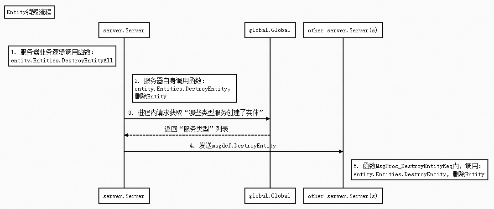

## 时序图



删除实体流程与创建实体流程很类似，不再详细介绍。

这里看下DestroyEntity函数细节

## DestroyEntity函数内部实现过程

##### 1. Entities.DestroyEntity

```go
func (es *Entities) DestroyEntity(entityID uint64) error {
	// ...(略)...
	e.(iEntityCtrl).OnEntityDestroyed()
	if !es.isMutilThread {
		e.(iEntityState).OnDestroy()
	}
	// ...(略)...
	return nil
}
func (e *Entity) MainLoop() {
	// ...(略)...
	ies := e.ieState
	switch e.state {
	// ...(略)...
	case iserver.Entity_State_Destroy:
		{
			ies.OnDestroy()
			e.state = iserver.Entity_State_InValid
		}
	// ...(略)...
	}
}
```
  - 会调用 Entity.OnEntityDestroyed
  - 最终会调用 Entity.OnDestroy

##### 2. Entity.OnEntityDestroyed

```go
func (e *Entity) OnEntityDestroyed() {
	if e.state == iserver.Entity_State_Loop || e.state == iserver.Entity_State_Init {
		e.state = iserver.Entity_State_Destroy
	}
}
```

目前没有做任何事情。

##### 3. Entity.OnDestroy

```go
func (e *Entity) OnDestroy() {
	if id, ok := e.GetRealPtr().(iEntityDestroy); ok {
		id.Destroy()
	}

	if !e.isGhost {
		e.unregSrvID()
	}
	e.reflushToDB()

	if e.clientSess != nil {
		e.clientSess.Close()
	}

	e.state = iserver.Entity_State_InValid
}
```

  - 触发调用，Destroy()函数。即，如RoomUser.Destroy()函数会自动被调用。
  - 执行unregSrvID函数，注销实体相关信息（如对应在哪些服务上被创建等信息）
  - 执行reflushToDB函数，保存实体数据到数据库
  - e.clientSess.Close()，如果可能的话关闭连接。zeus/space中的知识点。后续会介绍到。
