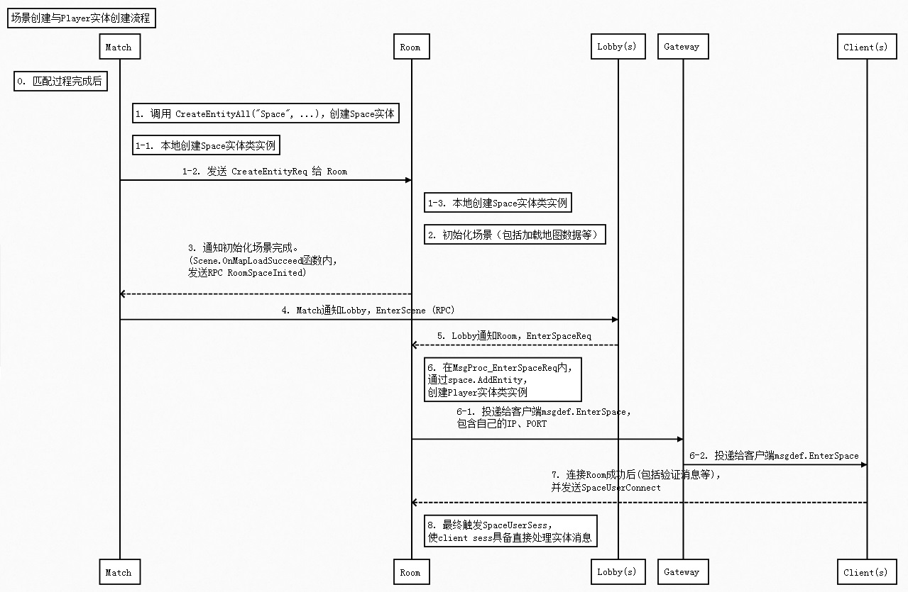

## 时序图



这个时序图，主要描述了`场景创建与Player实体创建流程`。

本时序图走完，场景实体、玩家实体都会被创建。

且之后Client->Room方式，客户端直接投递实体消息给玩家实体。

下面将对本时序图中的一些要点、疑点做下说明。

## 客户端直连

Room服务为了减少客户端到服务器的消息传递路径。

使用 SpaceSesses 组合嵌入了 sess.IMsgServer，扩展了TCP服务器的功能。使之能直接处理 Client->Room 的方式来投递实体消息。

主要代码如下：

```go
type SpaceSesses struct {
	clientSrv sess.IMsgServer
}

func (srv *SpaceSesses) Init() error {
	if err := srv.clientSrv.Start(); err != nil {
		panic(err)
	}
	srv.clientSrv.RegMsgProc(&SpaceSessesMsgProc{srv: srv})
	return nil
}

func (proc *SpaceSessesMsgProc) MsgProc_SpaceUserConnect(content interface{}) {
	// ...(略)...
	imh, ok := space.(msghandler.IMsgHandlers)
	if !ok {
		seelog.Error("this not go happen")
		return
	}
	imh.FireMsg("SpaceUserSess", sess)
}

func (proc *SpaceMsgProc) MsgProc_SpaceUserSess(sess iserver.ISess) {
	ie := proc.space.GetEntityByDBID("Player", sess.GetID())
	if ie == nil {
		proc.space.Error("there is no player in space ui = ", sess.GetID())
		sess.Close()
		return
	}

	ise, ok := ie.(iserver.ISpaceEntity)
	if !ok {
		proc.space.Error("conert to ispaceentity error , strange!! ")
		return
	}

	ise.SetClient(sess)
	// ...(略)...
}
```

代码分析：

  1. 客户端连接SpaceSessesTcp服务器后，发送 SpaceUserConnect
  1. MsgProc_SpaceUserConnect 处理器内，FireMsg("SpaceUserSess", ...)
  1. MsgProc_SpaceUserSess 处理器内，ise.SetClient(sess)。
  1. client sess被注册了space.Entity处理函数。因此可以直接处理实体消息

## Player实体在Room上的延迟创建

前面说过，服务器启动时，调用 RegProtoType 函数注册在哪些类型服务器上创建实体类实例。

然后调用 CreateEntityAll 方法，每个在对应被注册的服务器上，分别被创建。

Player实体在TimeFire中，做了特殊处理。

```go
func (es *ProtoType) RegProtoType(name string, protoType iserver.IEntity) {
	// ...(略)...

	// only not space entity should be register to server type list
	if _, ok := protoType.(iserver.ISpaceEntity); !ok {
			// ...(略)...
	}
}
```

RoomUser实现了iserver.ISpaceEntity接口，因此没有被注册进redis。

因此，Player实体在创建时，并没有在Room上创建。

Room上的Player实体类实例，是在匹配成功后的进场景流程中被创建的。

## 本流程的参考意义

本流程是目前TimeFire匹配开房间方式的创建场景、创建玩家实体的流程。

其他类型的场景创建，流程上不一定一致。

因此这里的流程，重点在于它的参考意义。以及如何初始化场景、玩家实体的细节。
