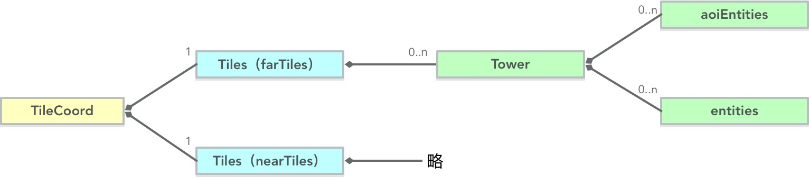

## 整体介绍

代码位于：zeus/space/TileCoord.go 文件中

AOI算法类型： AOI灯塔算法

## TileCoord类图

几点说明：
  - 优化AOI系统性能，根据可视距离，TileCoord内置2套AOI
  - 优化AOI系统性能，根据游戏对象是否具有AOI属性，分别在Tower.aoiEntities、Tower.entities内维护

## 场景游戏对象的2种属性

TileCoord根据这2种属性，管理它们。

我是斜对角线         | IsAOITrigger | IsNearAOILayer
  --------------------|--------------|----------------
Player、Car(Entity) | YES          | NO
Item(TileEntity)    | NO           | YES

其中：

  - Entity，在内置2套AOI中都会被维护
  - TileEntity，只在nearTiles内被维护

## 内置2套AOI

根据可视距离，TileCoord内置了2套AOI：
  - 一套可视距离为 300
  - 一套可视距离为 40

由于TileEntity对象很多。游戏需求是最大300视距。

若只有1套AOI，那么每次AOI操作，都要遍历 `300视距内的所有游戏对象 * 9`（存在大量的TileEntity）

因此，把TileEntity在放入40视距的AOI内。

看上去增加了2个AOI，然而实际遍历次数大大的减少。

因为300视距的AOI只有少量的Player、Car；40视距的虽然也重复包含了部分少量的Player、Car，但是TileEntity大量的减少。因此总体数量大大减少了。

## AOI事件

置于TileCoord内管理的游戏对象，会触发2种事件：

  - IAOITriggerEntity.OnEntityEnterAOI
  - IAOITriggerEntity.OnEntityLeaveAOI

具体有外部来实现事件触发后的具体逻辑。

## 重要API

API                       | 说明
--------------------------|---------------------------
TileCoord.UpdateCoord     | 加入TileCoord系统，或者更新位置
TileCoord.RemoveFromCoord | 从TileCoord系统中移除
TileCoord.TravsalAOI      | 获取视野范围内的游戏对象
TileCoord.TravsalRange    | 获取某点范围内的游戏对象
TileCoord.TravsalCenter   | 获取某点范围内的游戏对象
