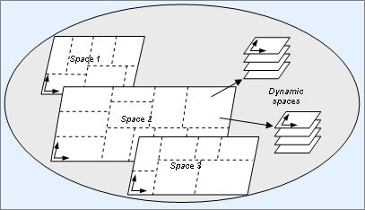
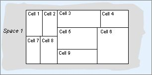

### 什么样的对象该定义成实体
	-- 有空间位置信息的对象，比如地图中掉落的物品，地图中的角色
	-- 两个或多个进程上都有的对象，比较典型的就是space, 一个进程可以负责space的一部分，也可以多个进程负责一个space,实现难度暴大
	-- 一些需要自动存储和读取数据的对象，比如Item,bag等。
	-- 一些全局的管理器，比如 matchMgr, teammgr,不建议使用实体，可能为了存储数据方便，定义成实体。
### 代码主要目录
- src\zeus\entity
- src\zeus\iserver
- src\zeus\space

### 区分普通entity和src\zeus\space文件夹中的entity,其实名字应该取不同的，免得混淆，后续待整理

### 轻量级的Entity, 场景中可以大量放置，主要是场景中的物品，节省开销
```go
type TinyEntity struct {
	id        uint64
	typ       string
	realPtr   interface{}
	space     iserver.ISpace
	initParam interface{}

	pos       linmath.Vector3
	rota      linmath.Vector3
	packState []byte

	props     map[string]*tinyPropInfo
	packProps []byte
}
```
### 创建Player

Gateway上玩家登录时会创建Player的entity

```go
func (mgr *GateUserMgr) addUser(uid uint64) *GateUser {

	user, err := GetSrvInst().CreateEntityAll("Player", uid, "", true)
	...
}
```
Gateway,lobby上会创建Player实体

Room上的Player实体创建要等玩家进room场景时才创建

### space





数据结构或接口 | 文件 | 说明
------------------------|-------------------------------------------| -------
CoordNode     | zeus\space\Coord.go            | CoordNode 节点
iAOIPacker, iAOISender     | zeus\space\Entity_AOI.go            | aoi
iEntrustCB, iUnEntrustCB   | zeus\space\Entity_Entrust.go       | 实体委托
无       | zeus\space\Entity_Link.go       | 实体链接
delayedCastMsg      | zeus\space\Entity_Msg.go       | 实体消息发送
EntityMsgProc      | zeus\space\Entity_MsgProc.go       | 实体消息处理
无      | zeus\space\Entity_Pos.go       | 实体位置
iPropsSender      | zeus\space\Entity_Pos.go       | 实体属性
无      | zeus\space\Space_map.go       | 射线检测相关
无      | zeus\space\Space_TinyEntity.go       | 微型实体
Space      | zeus\space\Space.go       | 空间实体
TileCoord      | zeus\space\TitleCoord.go       | 坐标


### entitydef
- 在zeus\entity\init.go下 init() initLogger()两个全局函数在服务器启动时会进行实体prop，和logger的初始化。
- 实体属性的定义在 res\entitydef\*.json
- 每个.json文件包含 "name":{}, "props":{}, "server":{}, "client":{}, "mrole":{},可以理解成属性的作用域，比如：Item.json, "name" : "Item"是实体entitytype, "props"是实体的属性，"server"是它的作用域在哪个server上，"client"代表客户端是否关注这个属性，"mrole":主角自己关注的属性
- "save": "0",是否存数据库的字段标识

### entity主循环
- 每个entity有个MainLoop()
```go
func (e *Entity) MainLoop() {

	ies := e.ieState

	switch e.state {
	case iserver.Entity_State_Init:
		{
			ies.OnInit()
			ies.OnAfterInit()
		}
	case iserver.Entity_State_Loop:
		{
			ies.OnLoop()
		}
	case iserver.Entity_State_Destroy:
		{
			ies.OnDestroy()
			e.state = iserver.Entity_State_InValid
		}
	default:
		{
			// do nothing
		}
	}
}
```
```go
func (e *Entity) OnInit() {
	e.state = iserver.Entity_State_Loop

	e.InitProp(GetDefs().GetDef(e.entityType))
	e.RegMsgProc(e.GetRealPtr())
	if !e.isGhost {
		e.regSrvID()
	}
}
```

```go
func (e *Entity) OnLoop() {
	// 每帧处理顺序:
	// 处理消息和业务逻辑, 在业务逻辑中更改属性, 发送RPC消息, 此时仅缓存需要发送的RPC消息
	// 同步属性变化消息
	// 真正发送RPC消息

	e.DoMsg()
  //调用后代的loop
	e.DoLooper()
	e.ReflushDirtyProp()
	e.FlushDelayedMsgs()
}
```

- 待补充


### entity register serverID

RegSrvID() 在实体创建时注册 注册类型和服务器信息,把当前entity所在的serverID等信息注册到redis数据库的entitysrvinfo里

regSrvID() -> RegSrvID(...)


```go


func (util *entitySrvUtil) RegSrvID(srvType uint8, srvID uint64, spaceID uint64, entityType string, dbID uint64) error {
c := GetServerRedis()
defer c.Close()

_, err := c.Do("HMSET", util.key(), srvType, util.joinSrvInfo(srvID, spaceID), fieldType, entityType, fieldDBID, dbID)
if err != nil {
	log.Error(err)
}
_, err = c.Do("HINCRBY", util.key(), fieldExistedCnt, 1)
return err
}

```


### 几个服务器进程启动时，Match上创建了MatchMgr,TeamMgr的entity

	MatchMgr，TeamMgr其实不应该定义成实体
```go
_, err := srv.CreateEntity("MatchMgr", srv.FetchTempID(), 0, 0, common.MatchMgrSolo, false, false, 0)
if err != nil {
  panic(err)
}
_, err = srv.CreateEntity("MatchMgr", srv.FetchTempID(), 0, 0, common.MatchMgrDuo, false, false, 0)
if err != nil {
  panic(err)
}
_, err = srv.CreateEntity("MatchMgr", srv.FetchTempID(), 0, 0, common.MatchMgrSquad, false, false, 0)
if err != nil {
  panic(err)
}
_, err = srv.CreateEntity("TeamMgr", srv.FetchTempID(), 0, 0, common.TeamMgr, false, false, 0)
```


### Entity几种消息发送方法

 待整理

### 以玩家进入房间来分析实体，这块比较绕
- RegProtoType 注册实体类型
- createEntity
- createEntityAll并非所有server上都会创建实体，只有这个server上注册了这个实体才会创建

- 实体的init和 oninit有什么区别,是否可以合并？
- 区分entity, 带有空间位置信息的entity和space, 比如 RoomChracter是带有空间位置信息的entity，space可以是一张超大的无缝地图，或者一个副本一个房间，要理解它跟RoomServer的关系，一个RoomServer可以包含1个或多个space(房间或副本)，一个RoomServer也可以只承担Space的一部分(无缝地图)
- space实体创建之后，会调用 space::loadMap
- space实体的作用域是Match, Room

```go
//match上
//Match\MatchMgr.go
func (mgr *MatchMgr) Loop() {
      ...
			if ws.IsReady() {
				ws.Go()
			...
		}
	}

	for {
		select {
		case s := <-mgr.scenesC:
			mgr.initScene(s)
		default:
			return
		}
	}
}

func (ws *WaitingScene) Go()
{
    GetSrvInst().CreateEntityAll("Space", 0, mapStr, false)
}


func (s *Space) OnAfterInit()
{
    //space实体
    s.Entity.OnAfterInit()
    s.loadMap()
}


Space::loadMap()
{
  //把物理的静态地图信息拷过来
	s.mapInfo = task.info
	s.onLoadMapFinished(ret)
}


Space::loadMap() -> Space::onLoadMapFinished -> Scene::OnMapLoadSucceed ->

Scene::OnMapLoadSucceed()
{
    // 通知Match, Space创建完成, 新的匹配流程
    if err := tb.RPC(common.ServerTypeMatch, "RoomSpaceInited"); err != nil {
        log.Error(err, tb)
    }
}
//match 处理
SceneMsgProc::RPC_RoomSpaceInited()
{
	proc.scene.onRoomSceneInited()
	proc.scene.status = common.SpaceStatusClose
}

Scene::onRoomSceneInited()
{
	 for   obj := range scene.objs
   {
		   obj.onRoomSceneInited(scene.GetID())
   }
}


// 房间创建成功, 通知玩家进入场景
MatchMember::onRoomSceneInited(spaceid uint64)
{
	 if err := mm.RPC(common.ServerTypeLobby, "EnterScene", spaceid); err != nil
   {
		   log.Error(err, mm.EntityProxy)
	 }
}

//lobby处理
// RPC_EnterScene 通知客户端进入房间
LobbyUserMsgProc::RPC_EnterScene(spaceid uint64)
{
	   proc.user.EnterSpace(spaceid)
}

Entity::EnterSpace(spaceID uint64)
{

	sendFunc := func() {
		msg := &msgdef.EnterSpaceReq{
			SrvID:      srvID,
			SpaceID:    spaceID,
			EntityType: e.entityType,
			EntityID:   e.entityID,
			DBID:       e.dbid,
			InitParam:  serializer.Serialize(e.initParam),
			OldSrvID:   0,
			OldSpaceID: 0,
		}

		if err := iserver.GetSrvInst().PostMsgToCell(srvID, spaceID, msg); err != nil {
			e.Error("Enter space failed: ", err)
		}
	}

  sendFunc()

}

//room上创建 player
SpaceMsgProc::MsgProc_EnterSpaceReq(content msgdef.IMsg)
{
  //创建了player, room上也就是roomuser
	err := proc.space.AddEntity(msg.EntityType, msg.EntityID, msg.DBID, params[0], false, false)
	if err != nil {
		proc.space.Error("Add entity error ", err, msg)
		return
	}
}

//zeus\entity下的entity
func (e *Entity) OnAfterInit()
{
	 e.Entity.OnAfterInit()
	  e.onEnterSpace()
}

//zeus\entity下的entity
func (e *Entity) onEnterSpace()
{
	 ic, ok := e.GetRealPtr().(IEnterSpace)
	  if ok {
		ic.OnEnterSpace()
	 }

	if e.IsWatcher() {
		msg := &msgdef.EnterSpace{
			SpaceID:   e.GetSpace().GetID(),
			MapName:   e.GetSpace().GetInitParam().(string),
			EntityID:  e.GetID(),
      //房间地址
			Addr:      iserver.GetSrvInst().GetCurSrvInfo().OuterAddress,
			TimeStamp: e.GetSpace().GetTimeStamp(),
		}
		if err := e.Post(iserver.ServerTypeClient, msg); err != nil {
			e.Error("Send EnterSpace failed ", err)
		}

		e.aoies = append(e.aoies, AOIInfo{true, e})
	}
}

RoomUser::Init(initParam interface{})
{
    user.RPC(common.ServerTypeLobby, "EnterRoomSuccess")
}

//lobby上处理
func  LobbyUserMsgProc::RPC_EnterRoomSuccess() {
	cost := time.Now().Sub(proc.user.enterRoomStamp).Nanoseconds() / 1000000
	proc.user.RPC(iserver.ServerTypeClient, "TransResult", "EnterSpace", true, cost)
}
```
