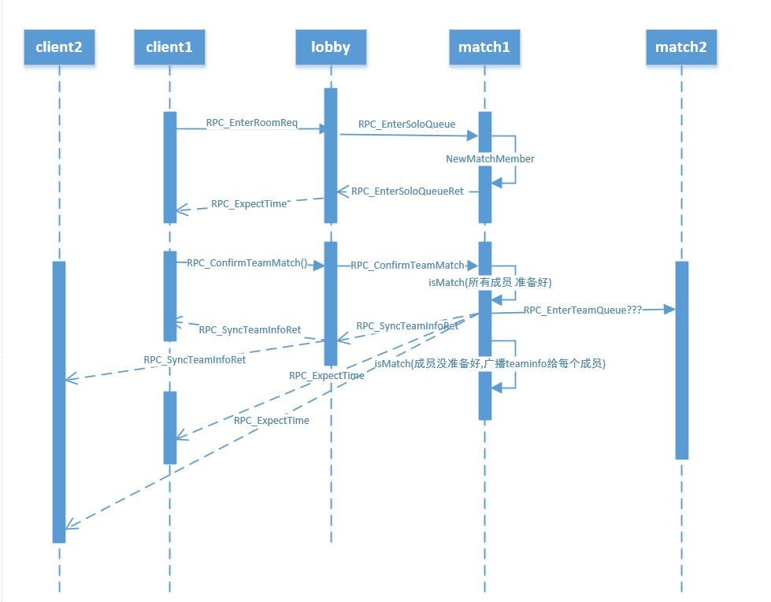

### 概述
- 匹配相关逻辑都放在match上,RPC消息处理在MatchMgrMsgProc.go里，每一个匹配模式有一个匹配管理器MatchMgr，MatchMgr负责管理等待状态的房间接口
- 队伍管理，RPC消息处理在TeamMgrMsgProc，TeamMgr负责队伍操作相关和队伍状态的管理。

### 匹配流程
- 队长(没有team就是自己一个人)发送进入匹配请求给lobby,lobby向match发送进入匹配请求，user在matchserver上挑选一个符合规则的房间，如果没有自己新建一个房间，匹配成功后告诉每个匹配成员匹配成功，通知客户端加载地图
- matchMgr上检查房间状态，符合条件开始比赛，通知roomserver加载地图场景，roomserver加载完毕通知matchserver加载完毕，matchserver通知每个成员所在的lobby,lobby再通知客户端开始进入房间场景。

### 匹配相关RPC方法进出口, 在LobbyUserMsgProc.go下
//点击进入单人匹配
RPC_EnterRoomReq
//单人匹配返回，发送匹配等待时间给客户端
RPC_EnterSoloQueueRet
//取消单人匹配
RPC_CancelEnterRoom
//取消单人匹配返回
RPC_CancelSoloQueueRet
//进入房间成功 此时RoomUser创建成功
RPC_EnterRoomSuccess()

### 匹配流程图

