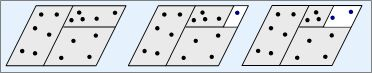

# 无缝大地图总体设计和任务列表

- 总体设计
    - lobby服务器可以作为实体的base部分.比如背包数据等。
    - 新增cellApp , 和cellAppMgr两个进程，cellApp多开，cellAppMgr是全局唯一的(cellAppMgr后期考虑扩展)
    - Space定义为较大的地图，一个游戏可以有1个或多个Space,每个Space对应物理上连续的一张地图。
    - cell是Space的一部分区域，cell的形状可以是正方形，长方形
    - cellApp进程会管理1个或多个Space, 1个SpaceID可以分配到多个CellApp进程上; 一个Space对象也可以是一个副本，也就是副本也是创建在cellApp进程上。主要功能有：
       1. space和cell对象的创建。
       2. 向cellappmgr汇报每个space上的cell负载
       3. 收到cellappmgr发送的cell大小变化或新增的消息后，在新的cellapp上创建新的空场景cell。
       4. 在新的cellapp上创建cell后，原cell上的entity发现自己不在边界内了，根据real, ghost的切换把entity转移过去新的cell
       5. 角色登录后最终会进入cell,也就是cell才是真正的场景
    - cellAppMgr进程管理所有的cellApp，主要功能有:
       1. 负责space和cell的ID生成，redis数据库递增生成。 cellapp向cellappmgr获得全局唯一的ID后再创建cell
       2. 接受cellapp汇报每个cell上的人数负载，cellappmgr根据cell上人数负载动态划分cell
       3. 不同cell大小发生变化时，实体数据的迁移。
       4. 角色进场景，能够根据位置坐标获得对应的cell进入场景。
       5. 维护cell之间的邻接关系，就是cell和cell之间的重叠区域
       6. ghost的创建等
```

## 任务列表(编码)

- 玩家登录(主要采用光荣使命的登录流程)(基本不需要改)
- 玩家登录后进入场景，需要lobby上发消息给cellappmMgr, 需要通过cellappMgr,知道分在哪个cellapp上(已做)
- aoi，移动这块可能要先加，可以参考光荣使命的(已做)
- cell类设计，比如cell的边界，坐标，压力，负责哪些实体等，CellAppMgr和CellApp上都有；设计一种规则，让cell能和哪些附近的cell通信(需要看space按照什么规则分割cell)(已做)
- Space类和Spaces类设计，CellAppMgr和CellApp上都有，Space管理多个cell，比如Space的划分，Space怎么切割成多个cell(已做)
- cell的拆分，主要是根据压力，通过bsptree实现(已做)
- cell在多个cellapp之间的动态迁移，主要是cell边界的迁移(已做)
- entity的ghost创建(注意创建时机，跟aoi有关)，每个cell会有附近cell上一部分实体的拷贝。(已做)
- 实体创建流程调整，需要经过CellAppMgr创建，并分配到合适的cell；实体的销毁善后，需要从cell里移除（已做）
- 使用go sdl2开发测试客户端，先测试无缝地图的移动(在做)
- 简单的技能使用，主要验证边界的分布式战斗(在做)
- 玩家在多个Cell之间的跳转，可能会涉及到gateserver, gateserver也要记录玩家在哪个Cell (待做)

- 实体的base部分设计，放在lobby上，比如背包数据，如果放在cell上，会导致cell之间实体切换时数据量很大（待做）
- 地图切割成多个chunks, 每个cellApp进程加载一个chunk,而不是整个地图。（待做）

## 地图分析的一些思考

- 动态加载地图可实现，上面的地图分割.jpg的大部分疑问不复存在，初始时1个space可能就1个cell, 根据entity数量增加或减少cell，记录cell分裂的过程，便于以后entity数量变少后cell再合并时能够追溯，有点类似操作系统的伙伴算法，具体实现时通过2叉树算法实现的，详见代码。
- cell的大小变化是比较缓慢的(比如隔一段时间变化一点)，防止大小变化过快，导致压力不均



## entity ghost的创建

- 到cell边界时,开始在重叠区域创建ghost, 出cell边界后一段距离后(出重叠区域的边界，开始做enity real ghost的切换，切换步骤

    1.立马把当前cell上的这个entity变成ghost,

    2.发消息给目标cell,创建相同enittyID的实体，并把entity置为real, 确认消息回给源cell,

    3.收到切换反馈的消息，如果不成功就回溯。

    注意点：如果在切换的过程中（有个消息传递的间隔），源cell上entity收到的消息，可以缓存后再丢给目标cell上的entity处理，也就是真正的实体

## real与ghost同步

- real上所有更改会同步最终值到ghost
- ghost可向real请求更改，发送更改量
